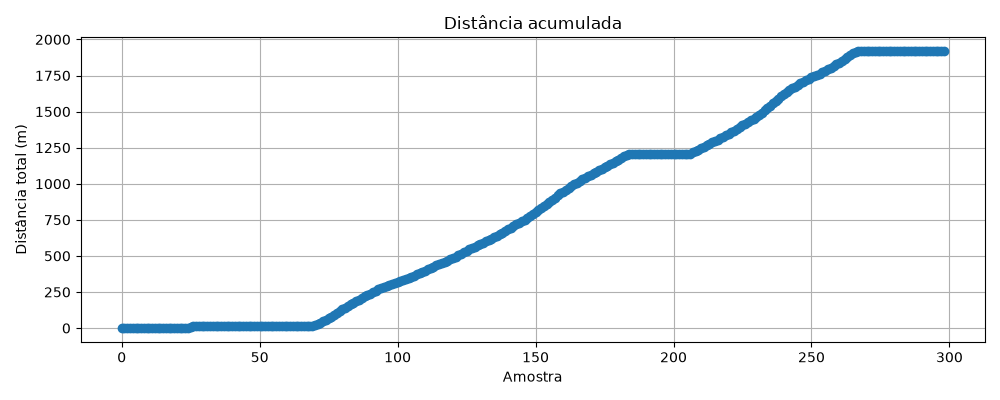
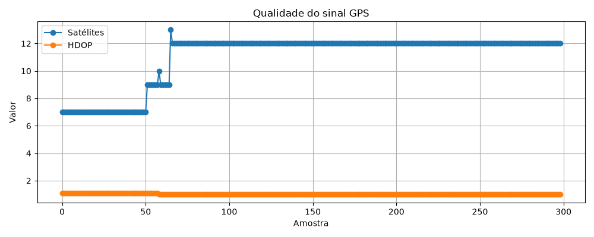
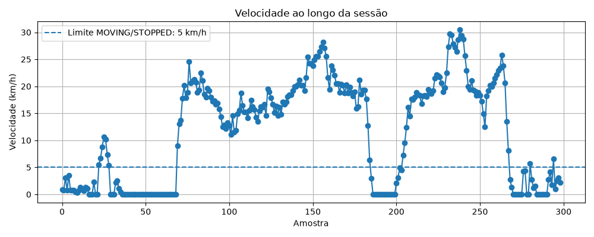
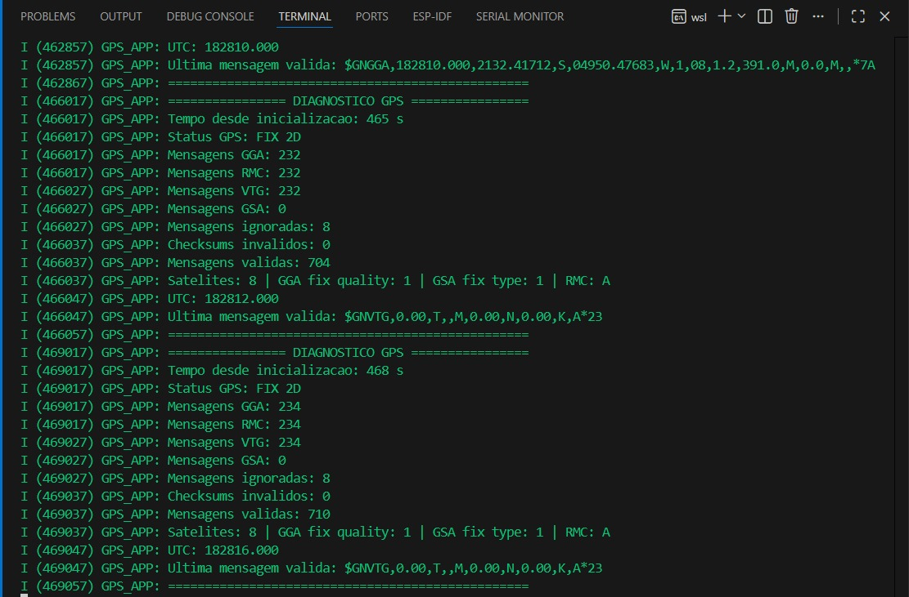
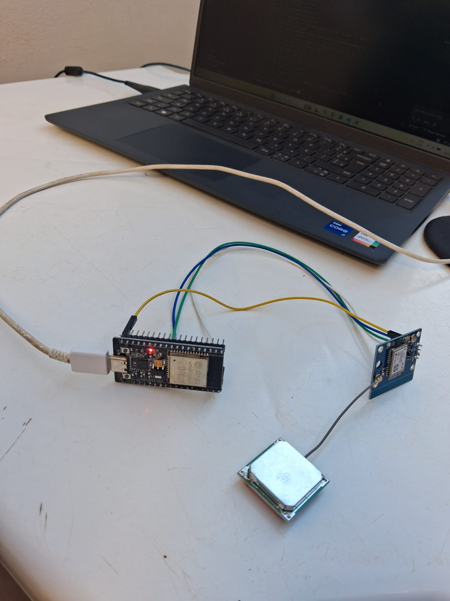
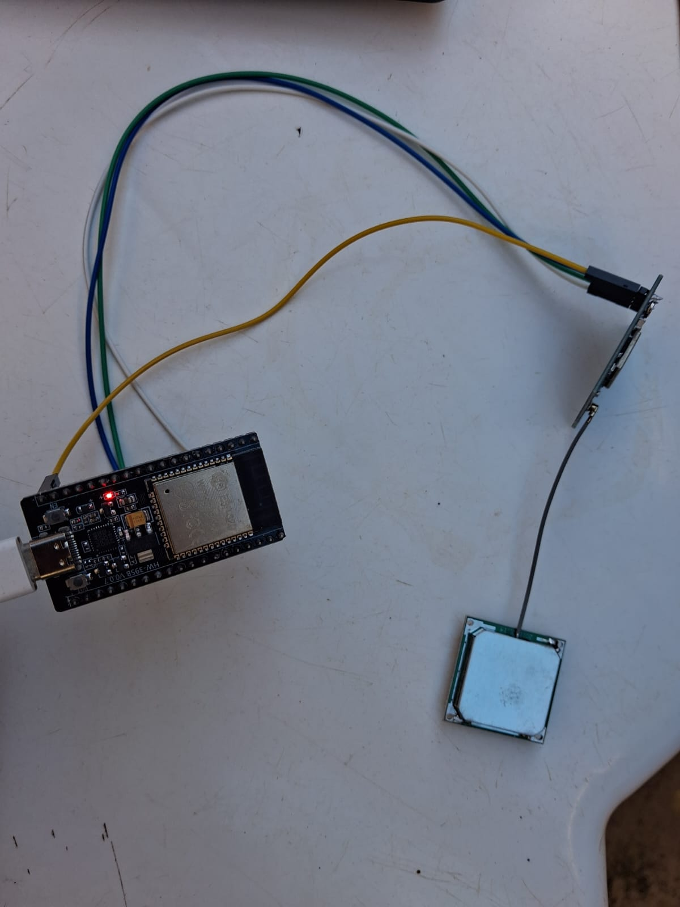

# ESP32 GPS Telemetry IDF

Sistema de telemetria GPS desenvolvido com **ESP32**, **ESP-IDF**, **GPS GY-NEO6MV2 / NEO-6M**, **UART**, **parser NMEA**, **microSD**, **arquivos CSV por sessão**, **exportação serial USB** e **análise offline com Python**.

O objetivo do projeto é coletar dados reais de localização e movimento, interpretar mensagens GPS em formato NMEA, calcular métricas de telemetria no firmware, armazenar os dados offline no microSD e analisar as sessões no computador com Python por meio de relatórios e gráficos.

Este projeto é desenvolvido com foco em práticas profissionais de firmware embarcado:

- ESP-IDF;
- comunicação UART;
- parser de protocolo NMEA;
- integração com hardware real;
- armazenamento offline em microSD;
- telemetria veicular;
- validação de campo;
- análise de dados com Python;
- documentação técnica baseada em testes reais.

---

## Status do Projeto

**Em desenvolvimento**

### Status atual

A etapa atual implementa e valida um fluxo completo de coleta e análise offline:

```text
ESP32 + GPS + microSD
        |
        v
Arquivo CSV por sessão
        |
        v
Exportação serial USB
        |
        v
Python no PC
        |
        +--> resumo TXT
        +--> resumo JSON
        +--> gráfico de velocidade
        +--> gráfico de distância acumulada
        +--> gráfico de qualidade GPS
```

O sistema já possui:

- leitura UART do módulo GPS no ESP32;
- recepção de sentenças NMEA reais;
- parser das sentenças `GGA`, `RMC` e `VTG`;
- extração de latitude, longitude, velocidade, satélites, HDOP e horário UTC;
- cálculo local de telemetria veicular;
- identificação de estado `STOPPED` e `MOVING`;
- cálculo de velocidade atual, velocidade máxima e velocidade média;
- cálculo de distância percorrida;
- cálculo de tempo parado e tempo em movimento;
- filtro contra drift do GPS parado;
- gravação dos dados em arquivos CSV no microSD;
- criação automática de arquivos por sessão;
- exportação de qualquer sessão pela serial USB;
- comandos seriais de diagnóstico e controle;
- análise Python dos arquivos CSV exportados;
- geração automática de gráficos e relatórios.

---

## Marco Atual — Análise Offline com Python

Após os testes com power bank e microSD, foi adicionada uma camada de análise offline em Python.

A estrutura atual da análise é:

```text
tools/
└── gps_analyzer/
    ├── analyze_session.py
    ├── data/
    │   ├── session_009.csv
    │   └── session_020.csv
    └── reports/
        ├── session_009_distance.png
        ├── session_009_gps_quality.png
        ├── session_009_speed.png
        ├── session_009_summary.json
        ├── session_009_summary.txt
        ├── session_020_distance.png
        ├── session_020_gps_quality.png
        ├── session_020_speed.png
        ├── session_020_summary.json
        └── session_020_summary.txt
```

O script `analyze_session.py` lê um arquivo `session_XXX.csv`, calcula métricas e gera arquivos de saída na pasta `reports/`.

Exemplo de execução:

```bash
cd ~/projetos/telemetria-gps
source .venv/bin/activate
python tools/gps_analyzer/analyze_session.py tools/gps_analyzer/data/session_020.csv
```

Saídas geradas:

```text
session_020_speed.png
session_020_distance.png
session_020_gps_quality.png
session_020_summary.txt
session_020_summary.json
```

---

## Teste de Campo — Sessão 020

Foi realizado um teste de campo mais longo utilizando o ESP32 alimentado por power bank, com o objetivo de validar aceleração, desaceleração, paradas e deslocamento em trajeto real ao redor do quarteirão.

O teste incluiu:

- trecho inicial parado;
- início de movimento;
- aceleração progressiva;
- desaceleração;
- parada intermediária;
- novo trecho em movimento;
- retorno e parada final;
- exportação da sessão pela serial USB;
- análise posterior com Python.

Resumo técnico da sessão 020:

```text
Sessão analisada: session_020.csv
Distância registrada no firmware: aproximadamente 1,92 km
Velocidade máxima registrada: 30,47 km/h
Satélites observados: 7 a 13
HDOP observado: 1,00 a 1,10
Status MOVING detectado: SIM
Status STOPPED detectado: SIM
Gravação em microSD: SIM
Exportação serial: SIM
Análise Python: SIM
```

As coordenadas reais foram omitidas ou devem ser tratadas com cuidado por privacidade.

### Gráfico de distância acumulada

O gráfico abaixo mostra a evolução da distância total ao longo da sessão. Os trechos planos indicam períodos em que o sistema permaneceu parado ou abaixo dos critérios mínimos de movimento. Os trechos inclinados indicam deslocamento real acumulado.



### Gráfico de qualidade do GPS

O gráfico abaixo mostra a quantidade de satélites e o HDOP durante a coleta. A sessão começou com cerca de 7 satélites e estabilizou em aproximadamente 12 satélites, com HDOP próximo de 1,0, indicando boa qualidade de sinal para o teste de campo.



### Gráfico de velocidade

O gráfico abaixo mostra a velocidade ao longo da sessão. A linha tracejada representa o limite de 5 km/h usado pelo firmware para diferenciar `STOPPED` e `MOVING`. O gráfico evidencia aceleração, desaceleração, paradas e retomadas durante o trajeto.



---

## Filtro de Movimento

Durante os testes foi observado que o GPS apresenta pequenas variações de latitude e longitude mesmo parado. Esse comportamento é esperado em receptores GNSS e é conhecido como drift do GPS.

Para evitar falso acúmulo de distância, o firmware utiliza filtros mínimos:

```c
#define TELEMETRY_MOVING_SPEED_THRESHOLD_KMH 5.0f
#define TELEMETRY_MIN_DISTANCE_M             5.0
```

Com isso, o sistema só considera movimento quando:

- o GPS possui fix válido;
- a velocidade está acima de 5 km/h;
- existe deslocamento mínimo relevante entre dois pontos;
- as coordenadas são válidas.

O limite foi mantido em **5 km/h** porque o foco do projeto é telemetria veicular. Os testes a pé e em baixa velocidade foram utilizados apenas para validação inicial em campo.

---

## Arquitetura Atual Implementada

```text
GPS GY-NEO6MV2 / NEO-6M
    |
    +--> Antena GPS externa
    |
    | UART 9600 bps
    v
ESP32 - UART2
    |
    | RX GPIO16
    | TX GPIO17
    v
gps_uart.c
    |
    | Leitura de linhas NMEA
    v
nmea_parser.c
    |
    | Parser GGA / RMC / VTG
    | Conversão de coordenadas NMEA para decimal
    | Extração de velocidade, satélites, HDOP e UTC
    v
telemetry.c
    |
    | Status parado / em movimento
    | Velocidade atual
    | Velocidade máxima
    | Velocidade média
    | Distância percorrida
    | Tempo parado
    | Tempo em movimento
    | Filtro contra drift
    v
sdcard_logger.c
    |
    | Gravação CSV no microSD
    | Criação automática de sessão
    | Comandos seriais
    | Exportação serial USB
    v
session_XXX.csv
    |
    | Exportação para o notebook
    v
analyze_session.py
    |
    | Análise de dados
    | Relatórios TXT/JSON
    | Gráficos PNG
    v
tools/gps_analyzer/reports/
```

---

## Estrutura Atual do Projeto

```text
telemetria-gps/
├── docs/
│   ├── images/
│   │   ├── gps_uart_saleae_logic.jpg
│   │   ├── gps_uart_espidf_monitor.jpg
│   │   ├── gps-fix-terminal.jpeg
│   │   ├── gps-esp32-montagem-antena.jpeg
│   │   ├── gps-ligacao-hardware.jpeg
│   │   ├── session_020_distance.png
│   │   ├── session_020_gps_quality.png
│   │   └── session_020_speed.png
│   └── logs/
│       ├── gps_fix_real_terminal.txt
│       └── telemetry_powerbank_export_raw.txt
├── gps_uart_test/
│   ├── CMakeLists.txt
│   ├── main/
│   │   ├── CMakeLists.txt
│   │   ├── main.c
│   │   ├── gps/
│   │   │   ├── gps_uart.c
│   │   │   ├── gps_uart.h
│   │   │   ├── nmea_parser.c
│   │   │   └── nmea_parser.h
│   │   ├── telemetry/
│   │   │   ├── telemetry.c
│   │   │   └── telemetry.h
│   │   ├── storage/
│   │   │   ├── sdcard_logger.c
│   │   │   └── sdcard_logger.h
│   │   └── legacy/
│   ├── sdkconfig
│   └── sdkconfig.old
├── tools/
│   └── gps_analyzer/
│       ├── analyze_session.py
│       ├── data/
│       │   ├── session_009.csv
│       │   └── session_020.csv
│       └── reports/
│           ├── session_020_distance.png
│           ├── session_020_gps_quality.png
│           ├── session_020_speed.png
│           ├── session_020_summary.json
│           └── session_020_summary.txt
├── mosquitto/
├── nodered/
├── docker-compose.yml
├── .gitignore
└── README.md
```

A pasta `build/` do ESP-IDF e o ambiente `.venv/` não devem ser versionados.

---

## Formato dos Arquivos CSV

Cada sessão é gravada no microSD como um arquivo separado:

```text
/sdcard/session_001.csv
/sdcard/session_002.csv
/sdcard/session_020.csv
```

Cabeçalho do CSV:

```csv
utc,latitude,longitude,speed_kmh,max_speed_kmh,avg_speed_kmh,total_distance_m,status,stopped_time_s,moving_time_s,satellites,hdop
```

Cada linha registra:

- horário UTC;
- latitude;
- longitude;
- velocidade atual;
- velocidade máxima;
- velocidade média;
- distância acumulada;
- status `MOVING` ou `STOPPED`;
- tempo parado;
- tempo em movimento;
- quantidade de satélites;
- HDOP.

---

## Comandos Seriais Implementados

O firmware aceita comandos digitados diretamente no `idf.py monitor`.

### Ver status do sistema

```text
status
```

Mostra informações da sessão atual, microSD, arquivo em uso, número de linhas gravadas e comandos disponíveis.

### Listar sessões gravadas

```text
list
```

Lista os arquivos de sessão encontrados no microSD.

### Exportar a sessão atual

```text
export
```

Exporta a sessão atual pela serial USB.

### Exportar uma sessão específica

```text
export 020
```

Exemplo de saída:

```text
---CSV_BEGIN_SESSION_020---
# FILE: /sdcard/session_020.csv
utc,latitude,longitude,speed_kmh,max_speed_kmh,avg_speed_kmh,total_distance_m,status,stopped_time_s,moving_time_s,satellites,hdop
...
---CSV_END_SESSION_020---
```

### Limpeza segura da sessão atual

```text
clear
```

O comando apenas exibe um aviso de segurança. Para confirmar:

```text
clear confirm
```

---

## Como Executar o Firmware

Entrar na pasta do projeto ESP-IDF:

```bash
cd ~/projetos/telemetria-gps/gps_uart_test
```

Carregar o ambiente ESP-IDF:

```bash
source ~/esp/esp-idf/export.sh
```

Definir o alvo:

```bash
idf.py set-target esp32
```

Compilar:

```bash
idf.py build
```

Gravar e abrir o monitor serial:

```bash
idf.py -p /dev/ttyUSB0 flash monitor
```

Caso a porta seja diferente:

```bash
ls /dev/ttyUSB*
ls /dev/ttyACM*
```

Para sair do monitor do ESP-IDF:

```text
CTRL + ]
```

---

## Como Exportar e Analisar uma Sessão

No monitor serial:

```text
status
list
export 020
```

Copiar o conteúdo CSV exportado e salvar em:

```text
tools/gps_analyzer/data/session_020.csv
```

Ativar o ambiente Python:

```bash
cd ~/projetos/telemetria-gps
source .venv/bin/activate
```

Executar a análise:

```bash
python tools/gps_analyzer/analyze_session.py tools/gps_analyzer/data/session_020.csv
```

Ver os arquivos gerados:

```bash
ls -l tools/gps_analyzer/reports/
```

Abrir a pasta no Windows Explorer:

```bash
explorer.exe tools/gps_analyzer/reports
```

---

## Módulos do Firmware

### `gps_uart.c`

Responsável por inicializar a UART2, configurar baud rate de 9600 bps, configurar RX em GPIO16, ler bytes recebidos do GPS e montar linhas NMEA completas.

### `nmea_parser.c`

Responsável por identificar sentenças `GGA`, `RMC` e `VTG`, separar campos NMEA, extrair horário UTC, latitude, longitude, velocidade, satélites, HDOP e converter coordenadas para graus decimais.

### `telemetry.c`

Responsável por calcular velocidade atual, velocidade máxima, velocidade média, distância percorrida, tempo parado, tempo em movimento e estado `STOPPED`/`MOVING`.

### `sdcard_logger.c`

Responsável por inicializar o microSD via SPI, criar arquivos CSV por sessão, gravar amostras, listar sessões, exportar sessões e realizar limpeza segura da sessão atual.

### `main.c`

Responsável por integrar UART, parser NMEA, telemetria, microSD e comandos seriais.

---

## Hardware Utilizado

| Componente | Função |
|---|---|
| ESP32 DevKit | Microcontrolador principal |
| GPS GY-NEO6MV2 / NEO-6M | Módulo GNSS |
| Antena GPS externa | Melhoria de recepção dos satélites |
| Módulo microSD | Armazenamento offline dos dados |
| Cartão microSD | Registro local dos arquivos CSV |
| Power bank | Alimentação autônoma para teste de campo |
| Analisador lógico | Validação física do sinal UART |
| Notebook Windows + WSL2 | Ambiente de desenvolvimento e análise |

---

## Ligações entre GPS e ESP32

| GPS | ESP32 |
|---|---|
| VCC | 3V3 |
| GND | GND |
| TX | GPIO16 |
| RX | GPIO17, opcional |

Ligação principal para leitura:

```text
GPS TX  -> ESP32 GPIO16
GPS GND -> ESP32 GND
```

---

## Ligações entre microSD e ESP32

| microSD | ESP32 |
|---|---|
| VCC | 5V |
| GND | GND |
| CS | GPIO5 |
| SCK/CLK | GPIO18 |
| MISO/DO | GPIO19 |
| MOSI/DI | GPIO23 |

Durante os testes, a comunicação SPI do microSD apresentou maior estabilidade com velocidade reduzida:

```c
host.max_freq_khz = SDMMC_FREQ_PROBING;
```

Essa configuração evitou falhas de comunicação como `ESP_ERR_INVALID_CRC`.

---

## Validação com Analisador Lógico

A comunicação UART entre o GPS e o ESP32 foi validada no nível físico utilizando analisador lógico.

Configuração utilizada no Saleae Logic 2:

```text
Decoder: Async Serial
Input Channel: D0
Bit Rate: 9600
Bits per Frame: 8
Stop Bits: 1
Parity: None
Signal: Non-inverted
```

Essa etapa confirmou que:

- o GPS transmitia dados pela UART;
- o baud rate estava correto;
- as mensagens NMEA eram válidas;
- o ESP32 recebia os mesmos dados observados no analisador lógico.


---

## Validação com Antena GPS

A antena externa foi conectada ao módulo GPS e o teste foi realizado em área externa.

O GPS obteve fix válido, confirmando:

- recepção real de satélites;
- funcionamento da antena externa;
- comunicação UART estável;
- dados NMEA válidos;
- leitura de satélites;
- leitura de HDOP;
- leitura de velocidade;
- leitura de latitude e longitude.







---

## Etapas Concluídas

- Preparação do ambiente Linux com WSL2;
- instalação e validação do Docker;
- criação da infraestrutura Docker com Mosquitto e Node-RED;
- teste MQTT local;
- criação do projeto ESP-IDF;
- validação UART com GPS;
- validação física com analisador lógico;
- parser NMEA inicial;
- diagnóstico técnico do GPS;
- validação com antena GPS externa;
- modularização do firmware;
- registro de dados reais do GPS;
- telemetria veicular embarcada;
- gravação em microSD;
- exportação serial do CSV;
- teste de campo com power bank;
- arquivos CSV por sessão;
- comandos seriais de diagnóstico e controle;
- análise offline com Python;
- geração de gráficos e relatórios da sessão 020.

---

## Próximas Etapas

### 1. Melhorar o analisador Python

Próximas melhorias previstas:

- descartar automaticamente linhas corrompidas da exportação serial;
- gerar gráfico de rota GPS em latitude/longitude;
- comparar distância do firmware com distância recalculada no Python;
- recalcular tempo parado e tempo em movimento;
- emitir alertas de qualidade de dados;
- gerar relatório final mais completo.

### 2. Integração MQTT

Após consolidar a análise offline, o próximo passo será transmitir dados em tempo real via MQTT.

### 3. Dashboard Node-RED

Criar dashboard para visualizar velocidade, distância, status, satélites, HDOP e posição.

### 4. Docker e ambiente local

Utilizar Docker Compose para padronizar Mosquitto, Node-RED e futuros serviços de banco de dados.

---

## Competências Demonstradas

Este projeto demonstra prática em:

- desenvolvimento de firmware em C com ESP-IDF;
- integração com sensores reais;
- leitura serial UART;
- parser de protocolo NMEA;
- comunicação SPI com microSD;
- arquitetura modular em firmware;
- logs e comandos seriais;
- validação com analisador lógico;
- teste de campo com alimentação autônoma;
- análise de dados com Python;
- geração de gráficos técnicos;
- documentação de engenharia baseada em evidências.

---

## Autor

Guilherme Costa

Projeto desenvolvido com foco em aprendizado e portfólio profissional nas áreas de:

- Sistemas embarcados;
- Firmware;
- ESP32;
- ESP-IDF;
- IoT;
- UART;
- SPI;
- GPS;
- Parser NMEA;
- microSD;
- Telemetria veicular;
- Linux;
- Docker;
- MQTT;
- Python para análise de dados;
- Validação de hardware com analisador lógico;
- Testes de campo com hardware real.
